# Nvidia Nsight Systems in AWS EC2 GPU instance

## Summary

The purpose of this document is to show how to run [Nvidia Nsight Systems](https://developer.nvidia.com/nsight-systems) from your local desktop to profile an EC2 GPU (i.e., g4dn.xl) instance’s performance. In order to make this work, you have to enable password login in the EC2, so Nsight can connect via SSH to the EC2 instance . Also, Nsight needs to have permission to access the GPU’s performance counters on the targeted device in the EC2 instance. This documentation provides instructions to the set up.

## Prerequisite

1. Download and install the version of [Nsight](https://developer.nvidia.com/nsight-systems) suited for your local environment.

2. Launch an EC2 instance with Nvidia GPU (i.e., g4dn.xl)

3. Clone https://github.com/NVIDIA-AI-IOT/torch2trt to the instance: 

```
git clone https://github.com/NVIDIA-AI-IOT/torch2trt
cd torch2trt
python setup.py install

python3 -m pip install --upgrade setuptools pip
python3 -m pip install nvidia-pyindex
python3 -m pip install --upgrade nvidia-tensorrt
```

4. A program (‘application’) in the EC2 in .py format that can be executed from a terminal via python

## Nsight systems

Below are sections describing how to connect Nsight to the targeted GPU in the EC2 instance and grant Nsight the permission to access GPU performance counters, which contains the metrics to be captured and profiled by Nsight.

### Enable EC2 password login

Nsight systems is a profiling tool that can run at your local computer and connect via SSH to your EC2 GPU instance. However, it requires you to enable password login in your EC2. This can be achieved by the [following steps](https://www.serverkaka.com/2018/08/enable-password-authentication-aws-ec2-instance.html):

1. Login to your EC2 instance via SSH as usual
2. Set a password: `ubuntu@ip-XXXX:~$ sudo passwd ubuntu`  then provide a password
3. Edit sshd_config file: `ubuntu@ip-XXXX:~$ sudo vi /etc/ssh/sshd_config`
4. In `PasswordAuthenticaion`, set it to yes.
5. Save the file and exit
6. Restart SSH service: `ubuntu@ip-XXXX:~$ service ssh restart`

### Grant Nsight the permission to access GPU performance counters

The full instruction for granting access permission to a GPU’s performance counters is [here](https://developer.nvidia.com/nvidia-development-tools-solutions-err_nvgpuctrperm-permission-issue-performance-counters). The only part applicable or needed is in the section “Command Line Control - Linux Only”, which explains how to use CLI to access the Nvidia Control Panel (‘window manager’) in the GPU.

In the EC2 instance, follow the steps below:


1. Unload old modules:
    a. `sudo systemctl isolate multi-user`
    b. `sudo modprobe -r nvidia_uvm nvidia_drm nvidia_modeset nvidia-vgpu-vfio nvidia`


2. Specify access:
    a. `sudo modprobe nvidia NVreg_RestrictProfilingToAdminUsers=0`


3. Restart the window manager:
    a. `sudo systemctl isolate graphical`

Now go back to your local desktop environment and launch Nsight:

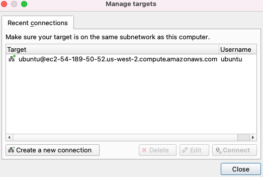


Click “Create a new connection”, you will see the dialog box for you to put in host and username:

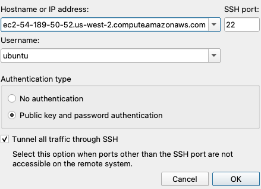

Select OK once you completed it. 

Now you may connect to this host and it will prompt you for the password you set up back in the EC2 instance:

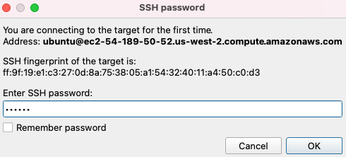

Now you should see the connection being made and expect it to look like this:

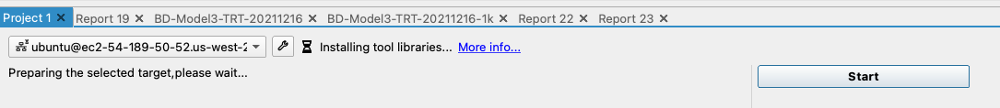

And eventually:

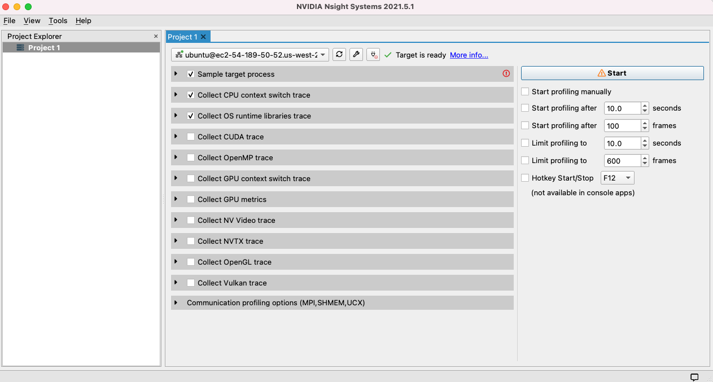

Now your Nsight systems in the local desktop is connected to your EC2 GPU instance.

Next, expand the first box ‘Sample target process’ to put in the command line with arguments and working directory of the program:

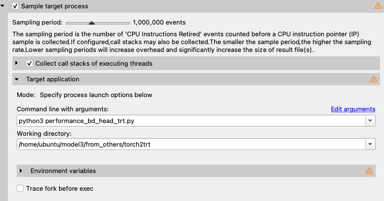

The above entries has to be exactly the same as if you are running it from an EC2 terminal. Make sure it works:

```
ubuntu@ip-XXXX:~/model3/from_others/torch2trt$ python3 performance_bd_head_trt.py
backbone inner_channels: 256
Warning: Encountered known unsupported method torch.Tensor.numel
Warning: Encountered known unsupported method torch.nn.functional.pixel_shuffle
Warning: Encountered known unsupported method torch.Tensor.numel
Warning: Encountered known unsupported method torch.nn.functional.pixel_shuffle
Batch size: 1
Samples: 5000
Models: 1
Dtype: torch.float16
Duration: 8.860
Throughput: 564.309
Latency P50: 1.756
Latency P95: 1.792
Latency P99: 1.844

backbone inner_channels: 256
results match
```

Finally, these are the checked boxes to indicate the metrics and traces I want to collect for this profiling job:

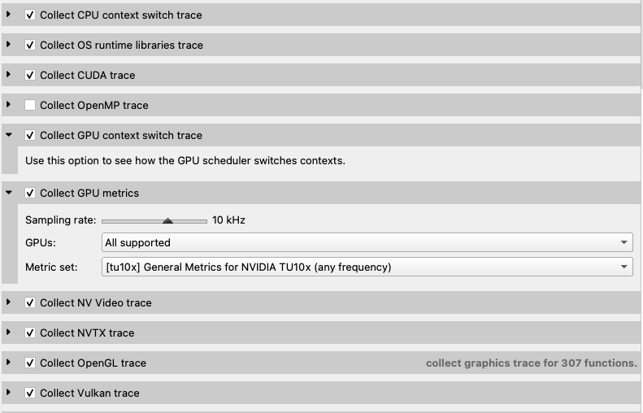

Now hit start:

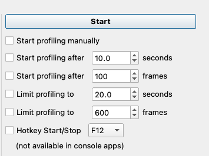

and the profiling job starts:

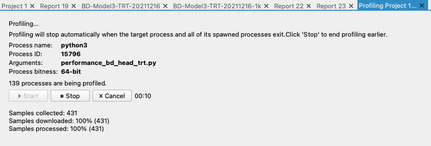

And once your profiling application is finished, Nsight starts to build a profiling report. This is not immediate and may take 10 to 20 minutes (if this is the first time on this desktop, see [Warning 1](). When it’s done, per image below, the profiling job results will be in Report 23 (you may rename it).

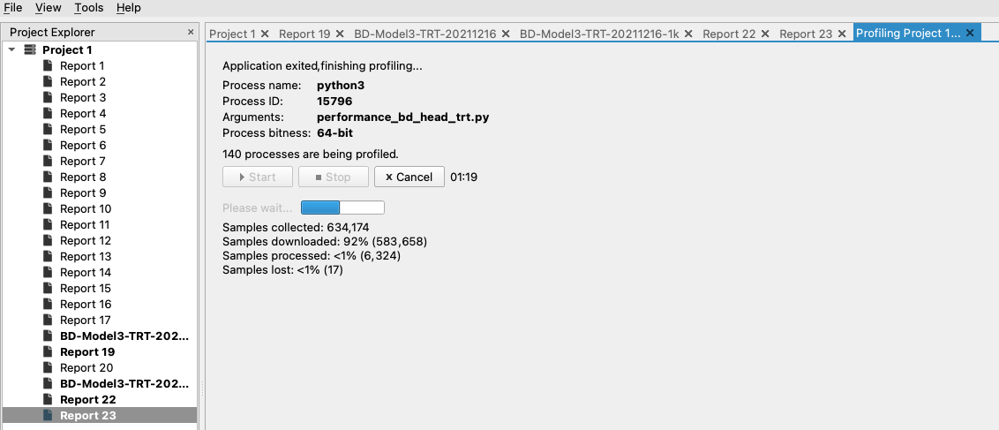

Select Timeline View:

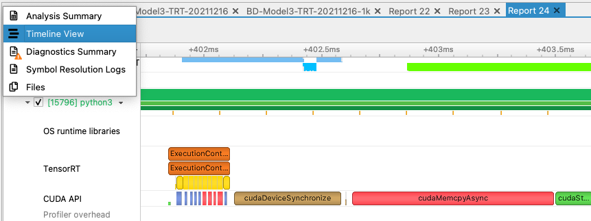

The profiling result may look like the figure below. To zoom in and out, hold cmd key and scroll one finger up or down on your Mac mouse:

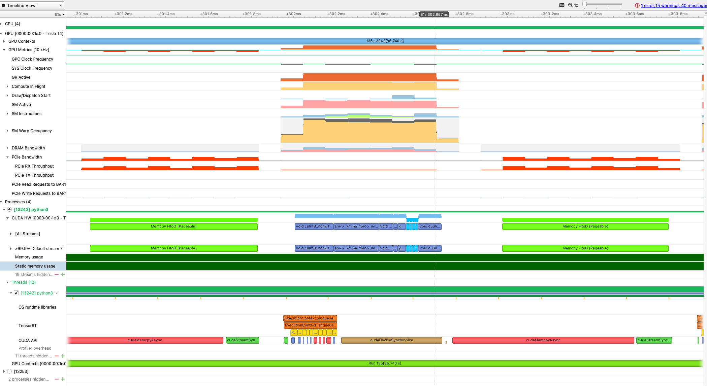


## Warnings

1. After the benchmarking application you ran has completed, Nsight will finish profiling and produce a report. If this is the first time you ran Nsight in your desktop system (i.e., Mac Book Pro), Nsight will download all the dependencies required to make a report of the profiling job from the EC2 instance, i.e., `~/.local/lib/python3.6/site-packages/tensorrt, and /nvidia...etc.`  This could take up to two hours. 
2. Nsight doesn’t know about Conda environment. Therefore do not use the pre-configured python enviroment came with the DLAMI for your profiling program. This means you need to build, run and test your profiling program with the clean python3 environment out-of-the-box in your instance, which means you need to build a fresh environment by installing torch, torchvision...etc for python3. 
3. The application or benchmark code needs to be refactored into a standalone application such as a .py file (it’s OK to have input arguments if necessary). I did not test Nsight with Jupyter notebook. 

Instance tested: g4dn.xl

